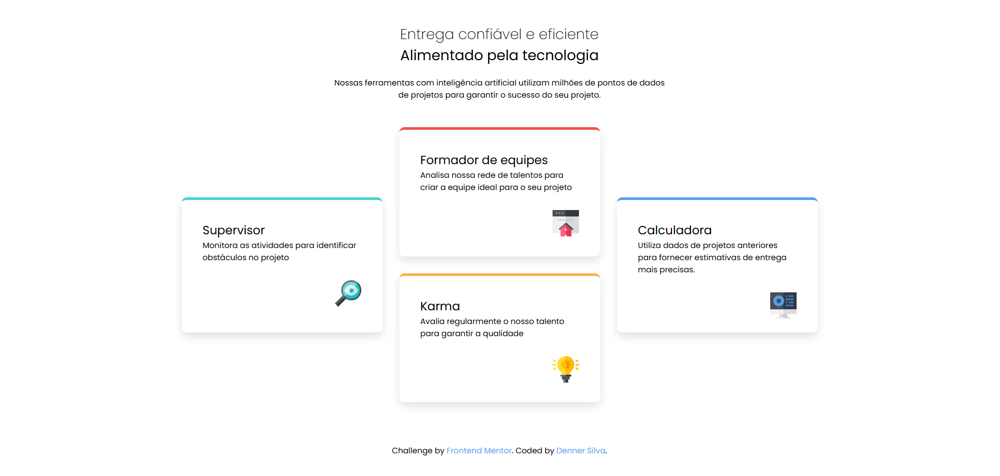

# Frontend Mentor - Solução para a seção de quatro cartões

Esta é uma solução para o [desafio da seção de quatro cartões no Frontend Mentor](https://www.frontendmentor.io/challenges/four-card-feature-section-weK1eFYK).

## Índice

- [Visão geral](#visão-geral)
- [O desafio](#o-desafio)
- [Captura de tela](#captura-de-tela)
- [Links](#links)
- [Meu processo](#meu-processo)
- [Construído com](#construído-com)
- [O que aprendi](#o-que-aprendi)
- [Desenvolvimento contínuo](#desenvolvimento-contínuo)

**Observação: exclua esta observação e atualize o índice com base nas seções que você mantiver.**

## Visão geral

### O desafio

Desafio concluído! Design responsivo e adaptável para mobile.
Bem estruturado e organizado.

### Captura de tela

### Links

- URL do site ao vivo: [Adicione o URL do site ao vivo aqui](https://secao-de-quatro-cartoes-navy.vercel.app/)

## Meu processo

### Construído com

- Marcação HTML5 semântica
- Propriedades personalizadas CSS
- Flexbox
- CSS Grid
- Fluxo de trabalho mobile-first

### O que aprendi

Coloquei em prática o Grid Layout, ainda estou em fazer de apredizagem dessa tecnologia.

### Desenvolvimento contínuo

Continuar praticando o Grid Layout

## Autor

- Instagram - [Denner Silva](https://www.instagram.com/denner_souza.s/)
